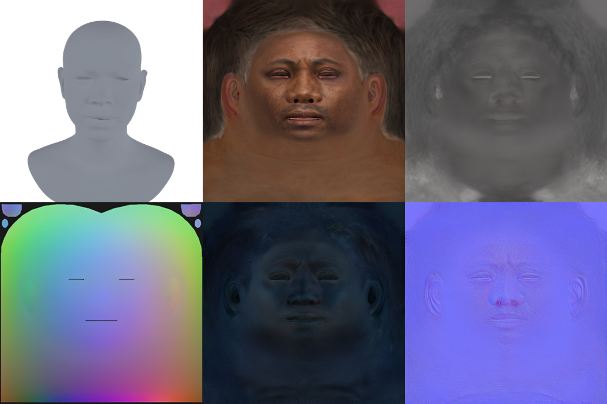

# ExpDiff: Generating High-fidelity Dynamic Facial Expressions with BRDF Textures via Diffusion Model
##  [Project Page](https://cyh-sj.github.io/expdiff/) | [Dataset](https://github.com/cyh-sj/expdiff)

 

## TODO
- [ ] Release the pre-trained models of ExpDiff.
- [ ] Release the scripts for ExpDiff, the generation of 3D facial assets.
- [ ] Release the J-Reflectance dataset.
- [ ] Release the FFHQ-BRDFExp dataset.

## J-Reflectance Dataset (Comming Soon)
### Agreement

1. The J-Reflectance dataset is available for **non-commercial** research purposes only.

2. You agree **not to** reproduce, modified, duplicate, copy, sell, trade, resell or exploit any portion of the images and any portion of the derived data for commercial purposes.

3. You agree **not to** further copy, publish or distribute any portion of the J-Reflectance dataset to any third party for any purpose. Except, for internal use at a single site within the same organization it is allowed to make copies of the dataset.

4. Shanghai Jiao Tong University reserves the right to terminate your access to the J-Reflectance dataset at any time.


### Overview
The J-Reflectance dataset is a large-scale 3D facial dataset with 100 high-quality identities of 32 expressions.

### Data Structure
```
J-Reflectance
├── train.json
├── test.json
├── person
│   ├── exp1
│   │   ├── shape.npy
│   │   ├── texture.png
│   │   ├── diffuse.png
│   │   ├── specular.png
│   │   ├── roughness.png
│   │   └── normal.png
│   └── ...
└── ...
```


## FFHQ-BRDFExp (Comming Soon)
To obtain the dynamic expression dataset, we first re-targeted the texture maps from FFHQ-UV to our own topology and resized them to 512x512. Next, we applied ExpDiff to obtain the dynamic meshes and BRDF texture maps. We then upscaled these texture maps to 4K resolution. The structure is the same as J-Reflectance.


 


## Citation
If you use this dataset, please consider citing
```
@inproceedings{cheng2025expdiff,
  title={ExpDiff: Generating High-fidelity Dynamic Facial Expressions with BRDF Textures via Diffusion Model},
  author={Cheng, Yuhao and Li, Xuanchen and Ren, Xingyu and Chen, Zhuo and Yang, Xiaokang and Yan, Yichao},
  year={2025}
}
```

## Contact
- Yuhao Cheng [(chengyuhao@sjtu.edu.cn)](chengyuhao@sjtu.edu.cn)